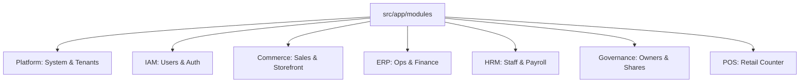

# Module Map & Architecture Guide 🗺️

This guide helps developers navigate the backend structure (`src/app/modules`).

## 🏢 Core Hierarchy

## 📂 Directory Reference

### 1. Apps Layer (`/apps`)

**"The Application Gateway"**

- `backend/`: The main API Gateway and Service consumer.
  - `src/app/`: Express App setup, Middlewares, Routes.
  - `src/core/`: Application-specific core logic (not to be confused with Monorepo Core).

### 2. Core Layer (`/core`)

**"The Foundation"** - Shared domains required by the entire platform.

- `iam/`: **Identity & Access Management** (Users, Roles, Permissions).
- `organization/`: **Tenancy Structure** (Organization, Business Unit, Outlet).
- `governance/`: **Compliance** (Legal entities, Shareholders).

### 3. Domains Layer (`/domains`)

**"The Business Logic"** - Grouped by high-level functional areas.

#### 🛒 Commerce (`/domains/commerce`)

- `catalog/`: Products, Categories, Brands.
- `sales/`: Orders, Invoices, Shipments.
- `storefront/`: Public website content.
- `pos/`: Point of Sale specific logic.
- `pricing/`: Price books and calculations.

#### 🏢 Enterprise (`/domains/enterprise`)

- `finance/`: Accounting, Tax, Ledgers.
- `supply/`: Inventory, Warehouses, Suppliers.
- `hrm/`: Employees, Payroll, Attendance.
- `ops/`: Operations management.
- `analytics/`: Business Intelligence & Reporting.

#### ⚙️ Platform (`/domains/platform`)

- `contracts/`: Shared interfaces and type definitions (if applicable).

## 🛑 Key Architecture Rules

1.  **Strict Module Boundaries**:
    - Do NOT import internal files from other modules.
    - ALWAYS import from the Module Barrel (e.g., `import ... from '@app/modules/erp'`).

2.  **Settings Hierarchy**:
    - **Global**: `Platform > Settings > SystemSettings`
    - **Organization**: `Platform > Org > Organization > Settings`
    - **Outlet**: `Platform > Org > Outlet > Settings`

3.  **License Enforcement**:
    - Use `RequireModule('moduleName')` middleware for all paid features.

---

_Generated for Onboarding - 2026_
