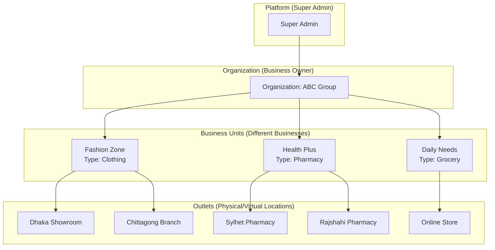
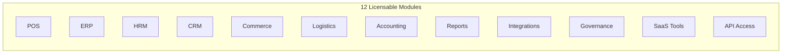
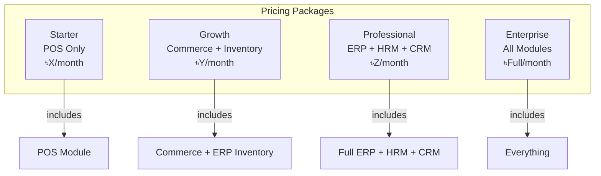
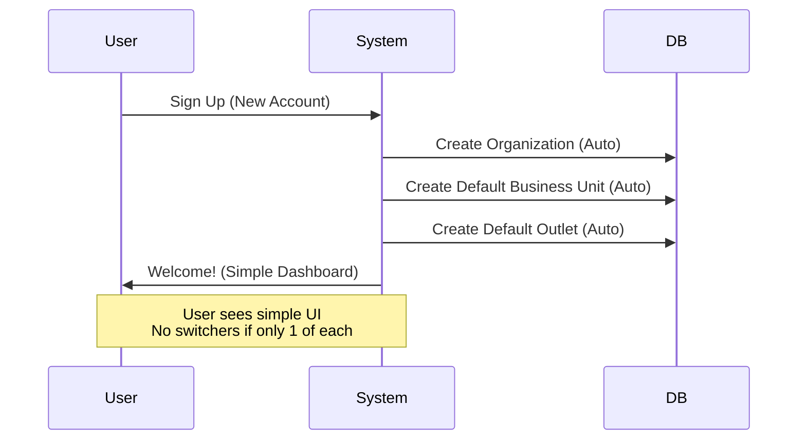
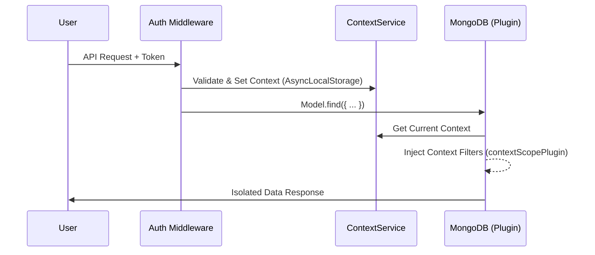
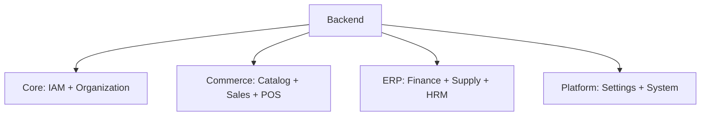

# Manoxen Enterprise Architecture - Design Decisions

> **Author:** System Architect  
> **Last Updated:** January 26, 2025  
> **Status:** Approved Design

---

## 1. Overview

Manoxen হলো একটি **Multi-Tenant SaaS Platform** যেখানে একজন ব্যক্তি/প্রতিষ্ঠান একাধিক ভিন্ন ধরনের ব্যবসা পরিচালনা করতে পারেন (Cloth, Pharmacy, Grocery, Restaurant ইত্যাদি)। প্রতিটি ব্যবসার বিভিন্ন স্থানে শাখা (Outlet) থাকতে পারে।

---

## 2. Core Hierarchy (তিন স্তরের কাঠামো)



### Hierarchy Definitions

| Level       | Name          | Description                                        | Example                      |
| ----------- | ------------- | -------------------------------------------------- | ---------------------------- |
| **Level 0** | Platform      | Super Admin পুরো সিস্টেম ম্যানেজ করে               | Manoxen Platform             |
| **Level 1** | Organization  | একটি প্রতিষ্ঠান/মালিক যার একাধিক ব্যবসা থাকতে পারে | ABC Group                    |
| **Level 2** | Business Unit | একটি নির্দিষ্ট ব্যবসা (Industry type অনুযায়ী)     | Fashion Zone, Health Plus    |
| **Level 3** | Outlet        | ব্যবসার একটি শাখা/লোকেশন                           | Dhaka Showroom, Online Store |

---

## 3. Licensable Modules (বিক্রয়যোগ্য মডিউল)



### Module → Hierarchy Level Mapping

> **Key Insight:** মডিউলগুলো একটি নির্দিষ্ট Level-এ আটকে নেই। একই মডিউল ভিন্ন ক্ষমতায় ভিন্ন Level-এ কাজ করে।

| Module                     |  Organization   |  Business Unit  |        Outlet        |
| -------------------------- | :-------------: | :-------------: | :------------------: |
| **POS**                    |       ❌        |       ❌        | ✅ কাউন্টারে ব্যবহার |
| **ERP (Finance)**          | ✅ Consolidated |  ✅ Per BU P&L  |          ❌          |
| **ERP (Inventory)**        |       ❌        | ✅ Master Stock |   ✅ Outlet Stock    |
| **HRM (Policies/Payroll)** |   ✅ Central    |       ❌        |          ❌          |
| **HRM (Staff/Attendance)** |       ❌        |    ✅ Roster    |     ✅ Clock-in      |
| **CRM (Customer Master)**  |  ✅ Unified DB  |       ✅        |          ✅          |
| **Commerce (Catalog)**     |       ❌        | ✅ Own Products |          ❌          |
| **Commerce (Orders)**      |       ❌        |       ✅        |      ✅ Fulfill      |
| **Logistics**              |       ❌        |       ✅        |     ✅ Ship from     |
| **Analytics/Reports**      |    ✅ All BU    |    ✅ Per BU    |    ✅ Per Outlet     |
| **Governance**             | ✅ Board/Audit  |       ❌        |          ❌          |
| **API Access**             |  ✅ Tenant Key  |       ❌        |          ❌          |

---

## 4. Pricing Strategy (How Modules are Sold)

> **Important Decision:** আমরা **মডিউল বিক্রি করি**, Context (Org/BU/Outlet) বিক্রি করি না। Context সবার জন্য সবসময় থাকে।



### Customer Examples

| Customer         | Structure                | Purchased Modules    | What They See          |
| ---------------- | ------------------------ | -------------------- | ---------------------- |
| ছোট ফার্মেসি     | 1 Org, 1 BU, 1 Outlet    | POS only             | শুধু POS মেনু          |
| ফ্যাশন চেইন      | 1 Org, 1 BU, 4 Outlets   | Commerce + Inventory | Catalog, Orders, Stock |
| বড় এন্টারপ্রাইজ | 1 Org, 5 BUs, 20 Outlets | All Modules          | সম্পূর্ণ মেনু          |

---

## 5. "Hidden Default" Strategy (Simplified UX)

> **Problem:** সবার জটিল Hierarchy লাগে না। ছোট ব্যবসায়ীর জন্য সিম্পল UX চাই।

### Solution: Auto-Provisioning



### UI Simplification Rules

```typescript
// Frontend Logic
if (businessUnits.length === 1) {
  hideBUSwitcher = true; // BU Dropdown দেখাবে না
}

if (outlets.length === 1) {
  hideOutletSwitcher = true; // Outlet Dropdown দেখাবে না
}

// URL Simplification
if (singleBU && singleOutlet) {
  // /dashboard (instead of /org/bu/outlet/dashboard)
}
```

---

## 6. Frontend Folder Structure (Final Decision)

> **Key Decision:** Context দিয়ে Route Separate করব, Module দিয়ে না।

```
apps/frontend/src/
├── features/                   ← MODULE LOGIC (Shared, Licensable)
│   ├── pos/
│   ├── erp/
│   ├── hrm/
│   ├── crm/
│   ├── commerce/
│   └── ...
│
├── app/(protected)/            ← CONTEXT-BASED ROUTING
│   │
│   ├── (platform)/             ← Super Admin Context
│   │   └── layout.tsx          (Platform Sidebar)
│   │
│   ├── (organization)/         ← Organization Owner Context
│   │   └── [organization]/
│   │       ├── finance/        ← uses features/erp
│   │       ├── governance/
│   │       └── layout.tsx      (Org Sidebar)
│   │
│   └── (business-unit)/        ← Business Unit Context
│       └── [organization]/
│           └── [business-unit]/
│               ├── inventory/   ← uses features/erp
│               ├── commerce/    ← uses features/commerce
│               ├── outlets/
│               │   └── [outletId]/
│               │       ├── pos/  ← uses features/pos
│               │       └── layout.tsx (Outlet UI)
│               └── layout.tsx   (BU Sidebar)
```

### Why Context-Based (Not Module-Based)?

| Approach                               | Problem                                              |
| -------------------------------------- | ---------------------------------------------------- |
| Module-based `/pos/org/bu/outlet`      | ইউজারের চিন্তার ধারার সাথে মেলে না                   |
| **Context-based `/org/bu/outlet/pos`** | ✅ ইউজার আগে Context বোঝে, তারপর Feature ব্যবহার করে |

---

## 7. Backend Model Verification ✅

> **Verified:** Backend-এ সম্পূর্ণ Hierarchy ও Module Licensing Support আছে।

### Organization Entity

```typescript
activeModules: {
  (pos,
    erp,
    hrm,
    commerce,
    crm,
    logistics,
    accounting,
    reports,
    integrations,
    governance,
    saas,
    api_access);
}
```

### BusinessUnit Entity

```typescript
organization: ObjectId (ref)
licensedModules: ['commerce', 'pos', 'erp', ...]
activeModules: { pos: {enabled, features}, erp: {...}, ... }
industry: 'fashion' | 'electronics' | 'grocery' | 'pharmacy' | ...
```

### Outlet Entity

```typescript
organization: ObjectId(ref);
businessUnit: ObjectId(ref);
activeModules: {
  (pos, erp, hrm, commerce, crm, logistics);
}
```

---

## 8. Zero Trust Security Architecture

> **Reference:** See [architecture_zenith.md](./architecture_zenith.md) for full details.

### Core Principle: Context-Driven Isolation



### Key Security Rules

| Rule                    | Description                                               |
| ----------------------- | --------------------------------------------------------- |
| **No Upward Access**    | Outlet user কখনো parent BU বা sibling data দেখতে পারবে না |
| **No Context, No Data** | Context undefined হলে query empty set / error দেয়        |
| **Identity ≠ Access**   | User-এর identity global, কিন্তু access bounded to context |

### Context-Scope Plugin (Automatic Protection)

- **Injects Filters:** সব `find`, `aggregate`, `update` query তে `organizationId`, `businessUnitId`, `outletId` prepend করে
- **Stamps Data:** `save`, `insertMany` তে auto-populate করে
- **Write Guard:** Target document-এর scope না মিললে write block করে

---

## 9. Settings Resolution System

> **Reference:** See [settings-resolution.md](./architecture/settings-resolution.md) for full details.

### Settings Cascade (Most Specific Wins)

```
Outlet Settings (Most Specific)
    ↓ (if not found)
Business Unit Settings
    ↓ (if not found)
Organization Settings
    ↓ (if not found)
Platform Settings (Fallback/Default)
```

### Example: Currency Resolution

```typescript
// Setup:
// - Platform: currency = "BDT"
// - Organization: currency = "USD"
// - BusinessUnit: (not set)
// - Outlet: (not set)

const currency = await resolveSettings("currency", context);
// Returns: "USD" (from Organization level)
```

### Settings Categories

| Category            | Examples                                     |
| ------------------- | -------------------------------------------- |
| **General**         | language, timezone, dateFormat, security     |
| **Commerce**        | inventory alerts, checkout options, shipping |
| **Finance**         | payment methods, tax rates, prefixes         |
| **Module-Specific** | POS receipt, HRM attendance                  |

---

## 10. Module Boundaries & Domain Rules

> **Reference:** See [module_map.md](./architecture/module_map.md) and [system-design.md](./architecture/system-design.md)

### Domain Architecture



### Strict Boundaries

| Rule                   | Description                                                   |
| ---------------------- | ------------------------------------------------------------- |
| **Module Imports**     | সবসময় Module Barrel থেকে import করবে, internal files থেকে না |
| **business-unit/core** | Source of truth; sub-modules এর উপর depend করে না             |
| **Platform vs ERP**    | Platform = Config/Switches; ERP = Calculations/Transactions   |

### License Enforcement

```typescript
// Middleware Usage
router.use("/pos/*", RequireModule("pos"));
router.use("/hrm/*", RequireModule("hrm"));
```

### Centralized Module Consistency ✅

- **Source of Truth:** `packages/shared-types/src/constants.ts` (`APP_MODULE_LIST`)
- **Implementation:** সব Backend Models (UserBusinessAccess, Promotion, Product, etc.) এবং Validators-এ এই constant ব্যবহার করা হয়েছে। এখন এক জায়গায় পরিবর্তন করলে পুরো সিস্টেমে আপডেট হয়ে যাবে।

---

## 11. Auto-Provision Implementation Points

| Where                          | What to Do                                     |
| ------------------------------ | ---------------------------------------------- |
| `OrganizationService.create()` | After Org creation → Auto-create Default BU    |
| `BusinessUnitService.create()` | After BU creation → Auto-create Default Outlet |
| Seeder                         | Demo data with full hierarchy for development  |

---

## 9. Key Architectural Decisions Summary

| Decision              | Choice                        | Reason                                    |
| --------------------- | ----------------------------- | ----------------------------------------- |
| Route Separation      | **Context-based**             | Matches user mental model                 |
| Module Logic Location | `src/features/`               | Shared across contexts, no duplication    |
| Outlet Routing        | Nested under BU               | Outlet always belongs to a BU             |
| POS UI                | Nested OR Separate App        | Touch-optimized, may need offline         |
| Storefront            | **Separate App**              | High traffic, SEO, different requirements |
| Sidebar               | Per-Layout Config             | Avoid giant if-else in single file        |
| Module Access Control | Feature flags + activeModules | Filter sidebar & routes dynamically       |

---

## 10. Future Considerations

- [ ] `apps/storefront` – Public E-commerce (Daraz-style)
- [ ] `apps/pos` – Dedicated POS App (if needed for offline/touch)
- [ ] Sidebar config split: `src/config/sidebar/{platform,org,bu}.ts`
- [ ] Module-based code splitting for performance

---

_This document serves as the single source of truth for Manoxen's architectural decisions._
